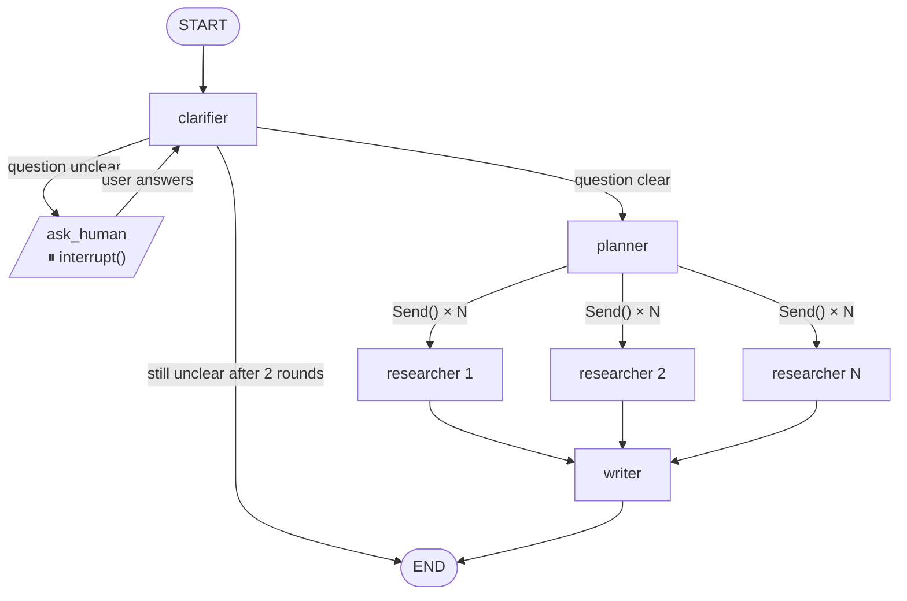
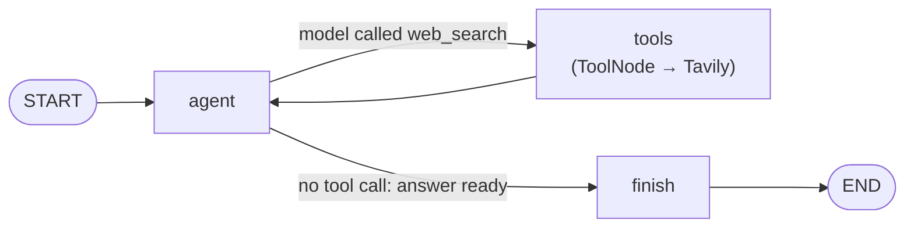

# Research Agent

A multi-agent research assistant built with **LangGraph** and **Google Gemini**. Ask it a question and it will:

1. **Clarify** the question with you if it's vague (human-in-the-loop),
2. **Plan** the research by breaking the question into focused sub-questions,
3. **Research** every sub-question **in parallel** with a separate researcher agent for each, which searches the web with **Tavily** when it needs facts,
4. **Write** a structured markdown report from the combined findings.

It runs as a chat-style **Streamlit** web app or as a command-line tool, and everything runs inside **Docker**.

---

## Highlights

| Feature | How it's built |
|---|---|
| Multi-agent pipeline | Four specialised agents (clarifier, planner, researcher, writer), each a LangGraph node with its own prompt and responsibility |
| Parallel research | LangGraph's `Send` API starts one researcher per sub-question at the same time |
| Tool-using agents | Each researcher is a LangGraph **subgraph** with a tool-calling loop (`bind_tools` + `ToolNode` + `tools_condition`). The model decides when to call `web_search` |
| Merging parallel results | An `operator.add` reducer on the state combines the findings from all researchers |
| Human-in-the-loop | `interrupt()` pauses the graph to ask the user a question, and `Command(resume=...)` continues the same run |
| Persistent runs | A checkpointer (`InMemorySaver`) and a `thread_id` let a paused run pick up exactly where it stopped |
| Reliable LLM output | The clarifier, planner and writer use Pydantic structured output instead of parsing free text |
| Live progress | `graph.stream(stream_mode="updates")` shows each agent's progress in the UI as it happens |
| Model selection | Choose the Gemini model from the UI; the whole graph is built for that model |

---

## Graph Architecture



Each **researcher** is its own subgraph, a tool-calling agent loop:



| Node | Role | Reads | Writes |
|---|---|---|---|
| `clarifier` | Decides whether the question is clear enough to research | `question`, `clarification_rounds` | `clarifying_question`, `clarification_rounds`, or `report` (when it gives up) |
| `ask_human` | Pauses the graph and waits for the user's answer | `clarifying_question` | `question` (with the Q&A appended) |
| `planner` | Breaks the question into independent sub-questions | `question` | `sub_questions` |
| `researcher` | Subgraph agent that answers one sub-question, searching the web as needed; N copies run in parallel | `sub_question` (its own input) | `findings` (merged with the reducer) |
| `writer` | Writes the final report, using only the findings | `question`, `findings` | `report` |

---

## How LangGraph Is Used

### Shared state

All agents share one typed state ([state.py](state.py)). Each node gets the current state and returns **only the keys it changes**. LangGraph merges that update into the state; nodes never modify the state directly.

```python
class ResearchState(TypedDict):
    question: str
    sub_questions: list[str]
    findings: Annotated[list[dict], operator.add]  # reducer: merge, don't overwrite
    report: str
    clarifying_question: str
    clarification_rounds: int
    iterations: int  # reserved for a future review loop
```

### Multi-agent fan-out with `Send`

The planner decides at run time how many sub-questions to create. A conditional edge turns each one into its own researcher run:

```python
def dispatch_researchers(state: ResearchState) -> list[Send]:
    return [Send("researcher", {"sub_question": q}) for q in state["sub_questions"]]

graph.add_conditional_edges("planner", dispatch_researchers, ["researcher"])
```

Each researcher gets a small, private input (`ResearcherState`) and returns `{"findings": [one_finding]}`. The `operator.add` reducer adds these lists together, so all the findings arrive intact even though the researchers finish at the same time and in any order.

### Tool-calling researcher subgraph

Each researcher is a compiled `StateGraph` added to the main graph as a single node, so `Send` can start many copies of it. Inside, it runs the standard LangGraph agent loop:

```python
@tool
def web_search(query: str) -> str:
    """Search the web for up-to-date information. Returns the top results with their URLs."""
    ...  # Tavily search, formatted as title / URL / content

graph = StateGraph(ResearcherAgentState, input_schema=ResearcherState, output_schema=ResearcherOutput)
graph.add_node("agent", self.agent)                 # LLM with bind_tools([web_search])
graph.add_node("tools", ToolNode([web_search]))     # runs whatever tool calls the LLM made
graph.add_node("finish", self.finish)               # turns the final answer into a finding
graph.add_conditional_edges("agent", tools_condition, {"tools": "tools", END: "finish"})
graph.add_edge("tools", "agent")
```

- **The model decides.** `tools_condition` checks the LLM's last message: if it has tool calls, the loop goes to `tools`, otherwise to `finish`. Simple questions are answered without searching; factual ones trigger one or more searches.
- **Private message history.** The subgraph keeps its own `messages` list (with the `add_messages` reducer). Its `output_schema` returns only `findings` to the parent, so the search transcripts never clutter the main state.
- **Search budget.** After `MAX_SEARCH_ROUNDS` (3) rounds of tool calls, the model is told to answer from the results it has, and any further tool calls are dropped in code. This caps latency and API usage.
- **Grounded answers.** The prompt requires a `Sources:` list with only URLs from the search results, and the writer carries them into the report's Sources section.

### Fan-in

LangGraph runs in steps. Every researcher started in the same step must finish before the next step starts, so the edge `researcher → writer` runs the writer **once**, with all the findings already merged.

### Human-in-the-loop with `interrupt`

When the clarifier decides a question is too vague, the graph goes to `ask_human`:

```python
def ask_human(state: ResearchState) -> dict:
    answer = interrupt(state["clarifying_question"])   # the graph pauses here
    return {"question": f"{state['question']}\nClarification - Q: ... A: {answer}"}
```

- The graph is compiled with a **checkpointer**, so the paused run's state is saved under its `thread_id`.
- The app shows the question to the user, then resumes **the same run** with `graph.invoke(Command(resume=answer), config)`.
- The answer is added to the question, and the flow loops back to the clarifier to check again.
- **Design choice:** on resume, LangGraph re-runs the interrupted node from its first line. So the LLM call is kept in `clarifier`, and `ask_human` contains only the `interrupt`. That way resuming never repeats an LLM call or produces a different question from the one the user answered.
- **Guardrail:** after `MAX_CLARIFICATION_ROUNDS` (2), a question that is still unclear ends the run with a request to rephrase, rather than researching guesses.

### Structured output

The clarifier, planner and writer bind a Pydantic schema to the LLM with `with_structured_output(...)`. For example, the planner returns `QuestionBreakdown(sub_questions: list[str])` and the clarifier returns `Clarification(needs_clarification: bool, clarifying_question: str)`. This gives typed, validated data that the routing functions can rely on.

---

## Project Structure

```
.
├── app.py               # Graph definition (nodes, edges, routing) + CLI entry point
├── streamlit_app.py     # Chat-style web UI with streaming progress and HITL
├── state.py             # ResearchState (shared) + researcher subgraph states
├── nodes/
│   ├── llm.py           # Shared Gemini client factory + list of available models
│   ├── clarifier.py     # Clarifier agent + ask_human (interrupt) node
│   ├── planner.py       # Planner agent
│   ├── researcher.py    # web_search tool + researcher subgraph (tool loop, runs in parallel)
│   └── writer.py        # Writer agent
├── Dockerfile
├── requirements.txt
└── .env.example         # Template for your API key
```

---

## Getting Started

### Prerequisites

- [Docker](https://docs.docker.com/get-docker/)
- A Google Gemini API key from [Google AI Studio](https://aistudio.google.com/apikey)
- A Tavily API key from [tavily.com](https://tavily.com) (the free tier includes 1,000 searches a month)

### 1. Clone the project and add your API key

```bash
git clone https://github.com/KirollosTadros/Research-AI.git
cd Research-AI
cp .env.example .env
```

Open `.env` and replace the placeholders with your keys:

```
GEMINI_API_KEY=your-gemini-api-key-here
TAVILY_API_KEY=your-tavily-api-key-here
```

### 2. Build the Docker image

```bash
docker build -t researcher .
```

### 3a. Run the web app

```bash
docker run --rm -it -p 8501:8501 -v "$(pwd)":/app researcher \
  streamlit run streamlit_app.py --server.address 0.0.0.0
```

Open **http://localhost:8501**, pick a model in the sidebar and ask a question.

### 3b. Or run it from the command line

```bash
docker run --rm -it -v "$(pwd)":/app researcher python app.py
```

The `-v "$(pwd)":/app` flag mounts the project into the container, so code changes take effect without rebuilding the image. Rebuild only when `requirements.txt` changes.

---

## Example Session

```
You:    Tell me about Mercury
Agent:  Are you asking about the planet Mercury or the chemical element mercury?
You:    The planet
Agent:  ▸ Research steps
          Clarifier says the question is clear
          Planner created N sub questions
          Researcher finished: ...
          Writer finished the report

        # The Planet Mercury
        ## Introduction
        Mercury is the smallest planet in our solar system ...
```

The terminal shows each agent's work as it happens, including the parallel researchers starting together and finishing in any order:

```
[planner] Created 3 sub questions
[researcher] Started: What is Rayleigh scattering and how does it affect sunlight?
[researcher] Started: Why does the human eye perceive blue light more strongly ...?
[researcher] Started: What role does the Earth's atmosphere play in scattering light?
[researcher] Finished: Why does the human eye perceive blue light more strongly ...?
[researcher] Finished: What is Rayleigh scattering and how does it affect sunlight?
[researcher] Finished: What role does the Earth's atmosphere play in scattering light?
[writer] Writing report from 3 findings
```

---

## Tech Stack

- **[LangGraph](https://langchain-ai.github.io/langgraph/)**: graph orchestration, parallel runs, checkpointing, interrupts
- **[LangChain Google GenAI](https://python.langchain.com/docs/integrations/chat/google_generative_ai/)**: Gemini chat models with structured output
- **Google Gemini**: the LLM behind every agent (the model can be chosen in the UI)
- **Tavily**: web search API for the researcher agents
- **Pydantic**: output schemas for each agent
- **Streamlit**: chat web interface
- **Docker**: reproducible Python 3.10 environment

---

## Limitations & Roadmap

- **Search quality depends on the snippets.** Researchers read Tavily's result snippets, not full web pages, so detailed questions may get shallow answers. Fetching full pages for the top results would improve this.
- **Checkpoints are kept in memory.** Paused runs are lost when the app restarts. Swapping `InMemorySaver` for `SqliteSaver` or `PostgresSaver` would make them last.
- **Planned: a review loop.** A reviewer node would check the findings for gaps and send the run back to the planner, using the `iterations` field as the limit.
- **Planned: memory between questions.** Each question currently starts a fresh run, so follow-up questions don't know about earlier ones.
